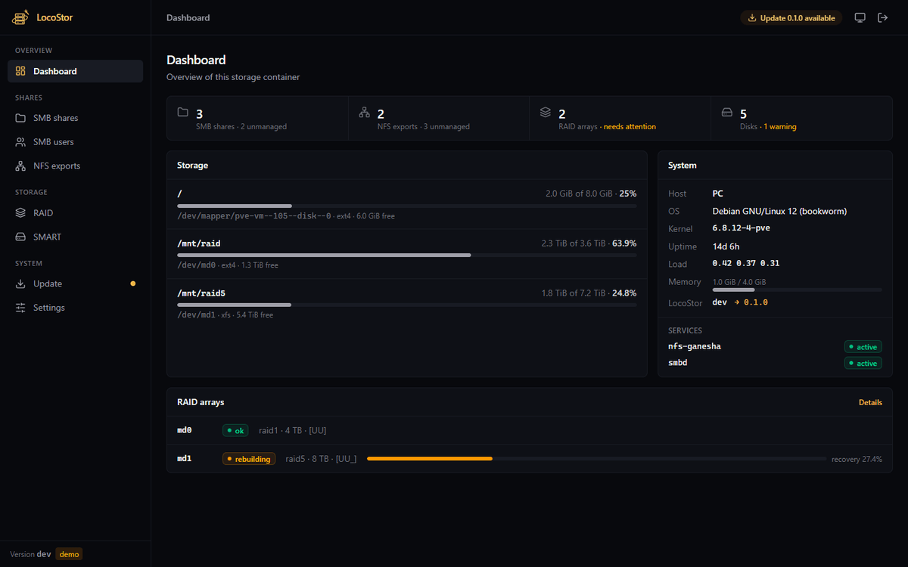

<p align="center">
  
</p>

<p align="center">
  Storage management for a Proxmox VE container – SMB, NFS, RAID and SMART in one small web UI.
</p>



## Features

- **SMB shares** – create, edit and remove Samba shares; manage SMB users
- **NFS exports** – manage NFS-Ganesha exports (NFSv3/v4, client lists, squash)
- **Existing shares** – shares from `smb.conf`, `ganesha.conf` and `/etc/exports` are detected and can be taken over
- **RAID status** – read-only view of the host's mdadm arrays incl. rebuild progress
- **SMART** – disk health via `smartctl`, USB disks via `-d sat`, sleeping disks are not woken up
- **Self-update** – checks GitHub Releases, one-click update (SHA-256 verified) and rollback
- Dark mode, responsive layout, password-protected, single binary without dependencies

LocoStor writes its shares to `/etc/samba/locostor.conf` and
`/etc/ganesha/locostor.conf`, which are included from the main configs.
Everything else in those files stays as it is.

## Installation

Create a **privileged** Debian container in Proxmox – no further setup
needed. Then run this on the Proxmox **host** shell:

```sh
curl -fsSL https://raw.githubusercontent.com/Phydran6/LocoStor/main/scripts/install.sh | sh
```

The installer asks for the container ID, mounts the RAID, passes the disks
through for SMART, installs LocoStor in the container and asks for an admin
password. Open `http://<container-ip>:8080` afterwards.

Details, manual setup and troubleshooting: **[docs/proxmox.md](docs/proxmox.md)**.
Run inside a container, the same command installs LocoStor only there.

## Configuration

`/etc/locostor/config.json` (created on first start):

| Key | Default | Description |
| --- | --- | --- |
| `listen` | `:8080` | Listen address |
| `password_hash` | – | bcrypt hash, set with `locostor passwd` |
| `update_repo` | `Phydran6/LocoStor` | GitHub repo for self-updates |
| `data_dir` | `/var/lib/locostor` | State files (shares, exports) |
| `tls_cert`, `tls_key` | – | Enable HTTPS with these files |
| `smart_devices` | – | Fixed disk list, e.g. `[{"device": "/dev/sda", "type": "sat"}]` |

Commands:

```
locostor [-config FILE] [-listen ADDR]   start the server
locostor passwd                          set the admin password
locostor version                         print the version
locostor -demo                           run with fake data (password: demo)
```

## Updates and rollback

The **Update** page shows the installed and latest version with release
notes. *Install update* downloads the binary for the current architecture,
verifies it against `SHA256SUMS`, keeps the running binary as
`locostor.previous` and restarts. *Roll back* swaps the two binaries again.
Shares are not interrupted – only the web UI restarts.

## Development

Requirements: Go 1.26+, Node.js 22+.

```sh
cd web && npm ci && npm run build && cd ..
go run ./cmd/locostor -demo            # http://localhost:8080, password "demo"
```

Demo mode works on any OS and never touches the system. For frontend work run
`npm run dev` in `web/` in parallel (proxies `/api` to port 8080).

```
cmd/locostor/     entry point, CLI
internal/api      REST API + static file serving
internal/smb      Samba shares and users
internal/nfs      NFS-Ganesha exports
internal/raid     /proc/mdstat parser
internal/smart    smartctl JSON parser
internal/update   GitHub Releases self-update
internal/demo     fake backends for -demo
web/              Svelte 5 + Tailwind 4 frontend (embedded from web/dist)
deploy/           systemd unit
scripts/          installer
```

## Releases

Versions follow [Semantic Versioning](https://semver.org). Pushing a tag
`vX.Y.Z` runs the release workflow, which builds `linux/amd64` and
`linux/arm64` binaries and publishes them with the matching section of
[CHANGELOG.md](CHANGELOG.md) as release notes.

```sh
git tag v0.2.0 && git push origin v0.2.0
```

## License

[MIT](LICENSE)
